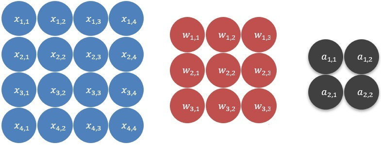

# im2col方法卷积原理

上面的链接是卷积网络的基本介绍，本篇讨论卷积层前项传播过程中的主要计算：**卷积**算法的实现

卷积计算的输入从二维的矩阵到四维张量，以及卷积核从二维矩阵到四维矩阵都对应不同大小的输出，最后会统一到一个算法里面，这里用一个函数来表示：
$$
a = conv(x, k)
$$
$x$ 是输入， $k$ 是卷积核， $a$ 是卷积的结果，即特征图（feature map)，先看输入和卷积核都是矩阵的情况：



上图中蓝色的为输入，红色的是卷积核，灰色是结果

卷积的过程就是，将输入划分成若干个**与卷积核相同大小**的不同子集，再分别与卷积核点乘：


现在，将上述的过程用公式向量表示，就拿第一个子集（将其表示为 $x^{(1)}$ ) 来说吧:
$$
x^{(1)}=
\begin{bmatrix}
x_{1,1}&x_{1,2}&x_{1,3}\\
x_{2,1}&x_{2,2}&x_{2,3}\\
x_{3,1}&x_{3,2}&x_{3,3}\\
\end{bmatrix}
$$
然后将其展开，变成一个行向量：
$$
x^{(1)} = 
\begin{bmatrix}
x_{1,1}&x_{1,2}&x_{1,3}&x_{2,1}&x_{2,2}&x_{2,3}&x_{3,1}&x_{3,2}&x_{3,3}
\end{bmatrix}
$$
对这四个子集都进行同样的操作，然后并在一起得到一个**矩阵**：

$$
X = 
\begin{bmatrix}
x^{(1)}\\
x^{(2)}\\
x^{(3)}\\
x^{(4)}\\
\end{bmatrix}
$$
同样的，再将卷积核如法炮制，只不过这次是展开成**列向量**：
$$
W = 
\begin{bmatrix}
w_{1,1}&w_{1,2}&w_{1,3}&w_{2,1}&w_{2,2}&w_{2,3}&w_{3,1}&w_{3,2}&w_{3,3}
\end{bmatrix}^{T}
$$
然后将 $X, W$​ 相乘，得到：
$$
A = XW = 
\begin{bmatrix}
x^{(1)}\\
x^{(2)}\\
x^{(3)}\\
x^{(4)}\\
\end{bmatrix}W = 
\begin{bmatrix}
x^{(1)}W\\
x^{(2)}W\\
x^{(3)}W\\
x^{(4)}W\\
\end{bmatrix} = 
\begin{bmatrix}
a_1\\
a_2\\
a_3\\
a_4\\
\end{bmatrix}
$$
最后将 $A$ 变形，就得到了卷积的结果：
$$
A = 
\begin{bmatrix}
a_1\\
a_2\\
a_3\\
a_4\\
\end{bmatrix}\rightarrow
\begin{bmatrix}
a_1&a_2\\
a_3&a_4\\
\end{bmatrix} =
\begin{bmatrix}
a_{1,1}&a_{1,2}\\
a_{2,1}&a_{2,2}\\
\end{bmatrix}
$$
以上，就是输入和卷积核都是矩阵时的情况，用一个公式总结一下：
$$
a_{i,j} = \sum_{h=0}^{k_H-1}\sum_{w=0}^{k_W-1}w_{h,w}x_{i+h,j+w}
$$
$k_H, k_W$​ 是卷积核的宽和高，这里是下标是从0开始的。

现在将输入升级为**多通道**（例如图片一般都是三通道的），即变成一个三维张量，相对应的，之前的情况称之为**单通道**；同时，卷积核也必须升级成多通道的，因为**卷积核的通道数必须与输入的通道数相等**：


如上图所示，输入变成双通道后，卷积核也必须变成双通道的，但是，输出还是一个通道，下面看一下计算过程，先画一个详细的图示：


同样，还是将输入划分成4个子集，具体的划分过程是，通道一和通道二各自划一个子集，与卷积核对应的通道大小相同：


将两个通道的子集上下拼接变成一个6行3列的矩阵，它们之间元素的顺序用下标表示：
$$
x^{(1)} = 
\begin{bmatrix}
x_{1,1,1}&x_{1,1,2}&x_{1,1,3}\\
x_{1,2,1}&x_{1,2,2}&x_{1,2,3}\\
x_{1,3,1}&x_{1,3,2}&x_{1,3,3}\\
x_{2,1,1}&x_{2,1,2}&x_{2,1,3}\\
x_{2,2,1}&x_{2,2,2}&x_{2,2,3}\\
x_{2,3,1}&x_{2,3,2}&x_{2,3,3}\\
\end{bmatrix} = 
\begin{bmatrix}
x_1&x_2&x_3\\
x_4&x_5&x_6\\
x_7&x_8&x_9\\
x_{10}&x_{11}&x_{12}\\
x_{13}&x_{14}&x_{15}\\
x_{16}&x_{17}&x_{18}\\
\end{bmatrix}
$$
然后同样的将其展开成一个**横向量**： $x^{(1)}=\begin{bmatrix}x_1&···&x_{18}\end{bmatrix}$ , 剩下的就是重复上述两步，得到4个横向量，得到一个**矩阵**：
$$
X = 
\begin{bmatrix}
x^{(1)}\\
x^{(2)}\\
x^{(3)}\\
x^{(4)}\\
\end{bmatrix}
$$
接下来，同样将卷积核也给展开，还是变成一个**列向量**，卷积核两个通道的元素之间的顺序处理与输入是一样的：
$$
W = 
\begin{bmatrix}
w_1&···&w_{18}
\end{bmatrix}^T
$$
然后，计算卷积结果：
$$
A = XW = 
\begin{bmatrix}
x^{(1)}\\
x^{(2)}\\
x^{(3)}\\
x^{(4)}\\
\end{bmatrix}W = 
\begin{bmatrix}
x^{(1)}W\\
x^{(2)}W\\
x^{(3)}W\\
x^{(4)}W\\
\end{bmatrix} = 
\begin{bmatrix}
a_1\\
a_2\\
a_3\\
a_4\\
\end{bmatrix}
$$
可以看到，多通道的情况与单通道的情况基本上是没有区别的；然后，还是公式：
$$
a_{i,j} = \sum_{h=0}^{k_H-1}\sum_{w=0}^{k_W-1}\sum_{c}w_{h,w,c}x_{i+h,j+w,c}
$$
上式中，$c$ 是通道数。

接下来，在多通道的基础上，进一步升级，使用**多个卷积核**，大致如下图：


可以看到，现在输出的结果变成多通道了，也就是说，**卷积结果的通道数等于卷积核的个数是一致的**，计算过程大致如下：

因为输入没有变化，所以划分出来的矩阵还是与之前一样：
$$
X = 
\begin{bmatrix}
x^{(1)}\\
x^{(2)}\\
x^{(3)}\\
x^{(4)}\\
\end{bmatrix}
$$
然后，对于第一个卷积核，处理的方式也和之前一样，展开成一个列向量，不过这里命名为 $W_1$ ：
$$
W_1 = 
\begin{bmatrix}
w_1&···&w_{18}
\end{bmatrix}^T
$$
然后对于第二个卷积核也是采取同样的操作展开成一个列向量，为 $W_2$ ，所以此时所有的卷积核可以用**一个矩阵**表示：
$$
W = \begin{bmatrix}W_1&W_2\end{bmatrix}
$$
然后是结算卷积结果：
$$
A = XW = 
\begin{bmatrix}
x^{(1)}\\
x^{(2)}\\
x^{(3)}\\
x^{(4)}\\
\end{bmatrix}
\begin{bmatrix}
W_1&W_2
\end{bmatrix} = 
\begin{bmatrix}
a_1&a_5\\
a_2&a_6\\
a_3&a_7\\
a_4&a_8\\
\end{bmatrix}
$$
从上式可以得知，各个每个卷积核是独立与输入进行卷积计算，相互之间并不影响；然后，将计算结果变形，就得到了输出：
$$
A = 
\begin{bmatrix}
a_1&a_5\\
a_2&a_6\\
a_3&a_7\\
a_4&a_8\\
\end{bmatrix}\rightarrow
\begin{bmatrix}
\begin{bmatrix}
a_1&a_2\\
a_3&a_4\\
\end{bmatrix}\\
\begin{bmatrix}
a_5&a_6\\
a_7&a_8\\
\end{bmatrix}
\end{bmatrix} = 
\begin{bmatrix}
\begin{bmatrix}
a_{1,1,1}&a_{1,1,2}\\
a_{1,2,1}&a_{1,2,2}\\
\end{bmatrix}\\
\begin{bmatrix}
a_{2,1,1}&a_{2,1,2}\\
a_{2,2,1}&a_{2,2,2}\\
\end{bmatrix}
\end{bmatrix}
$$
再上一个从网上找来的动图，相信能更好的理解


以上，就是多卷积核多通道的卷积变换矩阵乘法的过程，然后公式需要改一下：
$$
a_{i,j,d} = \sum_{h=0}^{k_H-1}\sum_{w=0}^{k_W-1}\sum_{c}w_{d,h,w,c}x_{i+h,j+w,c}
$$
上式中 $d$ 代表卷积核序号

剩下的就是扩展到批量的情况了：

有了前面多卷积核的计算过程做对比后，多输入的计算过程也是大同小异的，在前面的多卷积核的计算中，每个卷积核都独立与输入进行卷积，现在有多个输入也是一样，每一个输入独立与所有卷积核进行卷积计算得到一个输出，所以**输入的数量与输出的数量一致**。


还是来看栗子吧，设输入的批量为2，对第一个输入采用与前面一样的操作，变换为一个矩阵：
$$
X_1 = 
\begin{bmatrix}
x^{(1)}\\
x^{(2)}\\
x^{(3)}\\
x^{(4)}\\
\end{bmatrix}
$$
第二个输入变换为：
$$
X_2 = 
\begin{bmatrix}
x^{(5)}\\
x^{(6)}\\
x^{(7)}\\
x^{(8)}\\
\end{bmatrix}
$$
然后**将两个矩阵拼接在一起**，组成一个大矩阵：
$$
X = \begin{bmatrix}X_1\\X_2\end{bmatrix} = 
\begin{bmatrix}
x^{(1)}\\
x^{(2)}\\
x^{(3)}\\
x^{(4)}\\
x^{(5)}\\
x^{(6)}\\
x^{(7)}\\
x^{(8)}\\
\end{bmatrix}
$$
如果非常熟悉矩阵乘法，肯定已经知道了输出的结果：
$$
A = XW = 
\begin{bmatrix}
X_1\\
X_2\\
\end{bmatrix}
\begin{bmatrix}
W_1&W_2
\end{bmatrix} = 
\begin{bmatrix}
x^{(1)}\\
x^{(2)}\\
x^{(3)}\\
x^{(4)}\\
x^{(5)}\\
x^{(6)}\\
x^{(7)}\\
x^{(8)}\\
\end{bmatrix}
\begin{bmatrix}
W_1&W_2
\end{bmatrix} = 
\begin{bmatrix}
a_1&a_5\\
a_2&a_6\\
a_3&a_7\\
a_4&a_8\\
a_9&a_{13}\\
a_{10}&a_{14}\\
a_{11}&a_{15}\\
a_{12}&a_{16}\\
\end{bmatrix}
$$
上面 $a_1$ 至 $a_8$ 是 $X_1$ 与 $W$ 相乘的结果，$a_9$ 至 $a_16$ 是 $X_2$ 与 $W$ 相乘的结果，扩展到更一般的形式就是：
$$
XW = \begin{bmatrix}X_1\\X_2\\...\\X_m\end{bmatrix}\begin{bmatrix}W_1&W_2&...&W_n\end{bmatrix}
$$
所以，最后的公式就是：
$$
a_{n,i,j,d} = \sum_{h=0}^{k_H-1}\sum_{w=0}^{k_W-1}\sum_{c}w_{d,h,w,c}x_{n,i+h,j+w,c}
$$
最后，讨论一下卷积的**步长**：


上图是步长为1时的卷积结果，如果令步长为2，那么就变成了：


上图中的卷积结果为灰色的表示被表过，可以看到，步长为2时的情况相当于在步长为1的计算结果基础上每个一步取一个结果，同样，步长为3甚至更大也是依次类推

不过有时候输入的宽高不能恰好的被卷积核的大小和选定的步长所分割，例如上面的例子中，如果设步长为3，就会出现这种情况，这时候就看具体实现的策略了，可以直接抛弃那部分输入，或者给输入的边缘补0，或者直接抛出异常等等

接下来，就是用python实现了

```python
def im2col(img, ksize, stride=1):
    N, H, W, C = img.shape
    out_h = (H - ksize) // stride + 1
    out_w = (W - ksize) // stride + 1
    col = np.empty((N * out_h * out_w, ksize * ksize * C))
    outsize = out_w * out_h
    for y in range(out_h):
        y_min = y * stride
        y_max = y_min + ksize
        y_start = y * out_w
        for x in range(out_w):
            x_min = x * stride
            x_max = x_min + ksize
            col[y_start+x::outsize, :] = img[:, y_min:y_max, x_min:x_max, :].reshape(N, -1)
    return col
```

以上就是将卷积转换成矩阵乘法的关键函数im2col的实现，参数img是一个4维数组，而且在传进来之前就已经做过padding处理了，out_h，out_w，是卷积结果的宽高，例如输入的img的宽高是4x4的，卷积核的宽高是3x3，步长为1，那么其大小就是2x2了

这个函数前面基本上都是在做铺垫，只有最后一行是核心

```python
col[y_start+x::outsize, :] = img[:, y_min:y_max, x_min:x_max, :].reshape(N, -1)
```

还是拿刚才说的举例子，输入宽高4x4，卷积核宽高3x3，输出就是2x2，那么，单个的输入数据显然就转换成一个4行的矩阵。如果有1000个批量的数据输入呢？根据前面的推导，可以知道会转换成4000行的矩阵，并且每个输入都是以此排开的，既1-4行是第一个输入，5-8是第二个输入……3997-4000是第一千个输入

```python
img[:, y_min:y_max, x_min:x_max, :].reshape(N, -1)
```

这一句的功能就是，从输入的中划出一个子输入，例如从4x4的输入中，划出一个3x3的子输入，并且展开成一行，但是因为是批量输入，所以就要展开成N行，这里是1000行。

但是还不能直接赋给col，因为子输入是有顺序的，所以需要将其插入到这1000批数据中各自对应的行中，例如第一个子输入应该分别插入col的第1、5、9、13……3993，3997行，正好对应了下面这一句，将col的第一个维度切片：

```python
col[y_start+x::outsize, :]
```

最后说一下为什么要把C（通道）放在最后一个维度，因为python的多维数组是行优先，也就是从最后一个维度开始数的，所以尽量使低维度的数据在运算时保持连续，就能减少cache不命中的次数，从而提高性能

最后，在根据im2col包装一个conv函数：

```python
def conv(X, W, stride=1, padding='same'):
    FN, ksize, ksize, C = W.shape
    if padding == 'same':
	p = ksize // 2
	X = np.pad(X, ((0, 0), (p, p), (p, p), (0, 0)), 'constant')
    N, H, W, C = X.shape
    col = im2col(X, ksize, stride)
    z = np.dot(col, W.reshape(W.shape[0], -1).transpose())
    z = z.reshape(N, z.shape[0] / N, -1)
    out_h = (H - ksize) // stride + 1
    return z.reshape(N, out_h, -1 , FN)
```

感谢[@Sebastian](https://www.zhihu.com/people/943b11b97e588ca269413e3f0eafc7d6) 提供的另外一种实现方法，可以将im2col中的for循环全部去掉，实现可以看评论他的留言，另外还有一篇关于该方法的笔记：

[卷积算法另一种高效实现，as_strided详解](https://zhuanlan.zhihu.com/p/64933417)

# MIOpen Im2d2col的实现

根据输入参数的不同，miopen中Im2d2col有三种实现，每种实现都逐个batch进行，下面，讲解使用范围最广的一种实现，该实现分为两步，第一步将输入张量的各个部分映射到每个Block的LDS上，第一步实现如下：

<video id="video" controls="" preload="none"> <source id="mp4" src="images/im2d2col_stage_1.mp4" type="video/mp4"> </video>

第二步将各个Block LDS上的数据映射到输出张量上：

<video id="video" controls="" preload="none"> <source id="mp4" src="images/im2d2col_stage_2.mp4" type="video/mp4"> </video>


